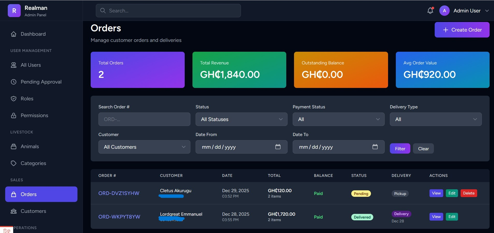

# 🐐 Realman Livestock Management System

A comprehensive Laravel 10 application for managing livestock business operations, including animal tracking, processing services, freezer inventory, order management, and customer relationships.

## 📋 Project Overview

Realman Livestock is a full-featured business management platform designed for small to medium-scale livestock businesses in Ghana. The system handles complete business operations from animal acquisition through processing, inventory management, order fulfillment, and delivery.

### Landing Page


### Product Category

### Order Management



**Tech Stack:**
- **Backend:** Laravel 10.10, PHP 8.2+
- **Frontend:** Blade Templates, Tailwind CSS, Alpine.js
- **Database:** MySQL 8.0
- **Authentication:** Laravel Breeze with Phone OTP verification
- **Authorization:** Spatie Laravel Permission (Role-based access control)
- **Notifications:** Multi-channel (Email via AWS SES, SMS via FrogSMS, Database)
- **Deployment:** Docker + AWS Fargate (ECS)

## 🚀 Quick Start

### Local Development Setup

1. **Clone the repository**
   ```bash
   git clone <repository-url>
   cd realman
   ```

2. **Install dependencies**
   ```bash
   composer install
   npm install
   ```

3. **Environment setup**
   ```bash
   cp .env.example .env
   php artisan key:generate
   ```

4. **Configure database** (update `.env`)
   ```env
   DB_CONNECTION=mysql
   DB_HOST=127.0.0.1
   DB_PORT=3306
   DB_DATABASE=realman
   DB_USERNAME=root
   DB_PASSWORD=
   ```

5. **Run migrations and seeders**
   ```bash
   php artisan migrate --seed
   ```

6. **Start development servers**
   ```bash
   # Terminal 1: Laravel
   php artisan serve

   # Terminal 2: Vite (for assets)
   npm run dev
   ```

7. **Access application**
   - Frontend: http://localhost:8000
   - Default admin credentials will be created by seeder (check `database/seeders/`)

## 📚 Documentation & Guides

### 📖 Core Documentation
- **[Complete Project Guide](README_PROJECT.md)** - Comprehensive project overview, features, and architecture
- **[Implementation Summary](IMPLEMENTATION_SUMMARY.md)** - Recent changes and implementation history

### 🔧 Feature Implementation Guides
- **[Phone Authentication & OTP](PHONE_AUTH_IMPLEMENTATION.md)** - Phone number verification and OTP setup
- **[SMS/OTP Integration](SMS_OTP_DOCUMENTATION.md)** - FrogSMS API integration details
- **[Order Notifications System](ORDER_NOTIFICATIONS_GUIDE.md)** - Multi-channel notification setup (Email, SMS, Database)
- **[Order Status Workflow](ORDER_STATUS_WORKFLOW.md)** - Complete order lifecycle and status transitions
- **[Field Reference Verification](FIELD_REFERENCE_VERIFICATION.md)** - Database schema reference guide
- **[System Log Viewer](SYSTEM_LOG_VIEWER.md)** - View and manage application logs from web interface

### ☁️ AWS Deployment Guides
- **[AWS Architecture Design](AWS_ARCHITECTURE_DESIGN.md)** - Complete infrastructure architecture and regional analysis
- **[AWS Fargate Setup](AWS_FARGATE_SETUP.md)** - Containerized deployment with ECS Fargate (RECOMMENDED)
- **[AWS Configuration Guide](AWS_CONFIGURATION_GUIDE.md)** - Step-by-step AWS services setup
- **[AWS Quick Reference](AWS_QUICK_REFERENCE.md)** - Common commands and troubleshooting
- **[Production Deployment](PRODUCTION_DEPLOYMENT.md)** - Production deployment checklist and requirements
- **[Docker Deployment](DOCKER_DEPLOYMENT.md)** - Docker configuration and container setup
- **[S3 Implementation Guide](S3_IMPLEMENTATION_GUIDE.md)** - File storage migration to AWS S3

## 🏗️ Project Structure

### Key Directories

```
app/
├── Http/Controllers/
│   ├── Admin/          # Admin panel controllers (users, roles, reports)
│   ├── Manager/        # Manager controllers (animals, processing, inventory)
│   ├── Auth/           # Authentication controllers (OTP, approval workflow)
│   └── Api/            # API endpoints (if applicable)
├── Models/             # Eloquent models (Animal, Order, Customer, etc.)
├── Notifications/      # Multi-channel notifications (OrderPlaced, OrderStatusChanged)
├── Services/           # Business logic (SMSService, PaymentService, etc.)
├── Exports/            # Excel export classes (Reports)
└── Mail/               # Email mailable classes

resources/
├── views/
│   ├── admin/          # Admin panel views
│   ├── manager/        # Manager dashboard views
│   ├── auth/           # Authentication views (login, OTP verification)
│   └── emails/         # Email templates
└── js/                 # Frontend JavaScript

routes/
├── web.php             # Public web routes
├── admin.php           # Admin routes (admin.* middleware)
├── manager.php         # Manager routes (manager.* middleware)
└── api.php             # API routes

database/
├── migrations/         # Database schema migrations
└── seeders/            # Database seeders (roles, demo data)
```

## 🔑 Key Features & Where to Find Them

### 🐑 Animal Management
- **Controllers:** `app/Http/Controllers/Manager/AnimalController.php`
- **Models:** `app/Models/Animal.php`, `app/Models/HealthRecord.php`
- **Views:** `resources/views/manager/animals/`
- **Routes:** `routes/manager.php`

### 📦 Order Management
- **Controllers:** `app/Http/Controllers/Manager/OrderController.php`
- **Models:** `app/Models/Order.php`, `app/Models/OrderItem.php`, `app/Models/OrderStatusHistory.php`
- **Notifications:** `app/Notifications/OrderPlaced.php`, `app/Notifications/OrderStatusChanged.php`
- **Views:** `resources/views/manager/orders/`
- **Email Templates:** `resources/views/emails/orders/`

### 🥩 Processing Requests
- **Controllers:** `app/Http/Controllers/Manager/ProcessingController.php`
- **Models:** `app/Models/ProcessingRequest.php`
- **Views:** `resources/views/manager/processing/`

### ❄️ Freezer Inventory
- **Controllers:** `app/Http/Controllers/Manager/FreezerInventoryController.php`
- **Models:** `app/Models/FreezerInventory.php`
- **Views:** `resources/views/manager/freezer/`

### 👥 Customer & User Management
- **Controllers:** `app/Http/Controllers/Admin/UserController.php`, `app/Http/Controllers/Admin/CustomerController.php`
- **Models:** `app/Models/User.php`, `app/Models/Customer.php`
- **Views:** `resources/views/admin/users/`, `resources/views/admin/customers/`

### 📊 Reports & Analytics
- **Controllers:** `app/Http/Controllers/Admin/ReportController.php`
- **Exports:** `app/Exports/*ReportExport.php`
- **Views:** `resources/views/admin/reports/`

### 🔔 Notifications
- **Email:** `app/Notifications/OrderPlaced.php`, `app/Notifications/OrderStatusChanged.php`
- **SMS:** `app/Notifications/Channels/SMSChannel.php`, `app/Services/SMSService.php`
- **Templates:** `resources/views/emails/orders/confirmation.blade.php`
- **Guide:** See [ORDER_NOTIFICATIONS_GUIDE.md](ORDER_NOTIFICATIONS_GUIDE.md)

## 🛠️ Common Development Tasks

### Adding New Features

1. **Create migration:**
   ```bash
   php artisan make:migration create_table_name
   php artisan migrate
   ```

2. **Create model with controller:**
   ```bash
   php artisan make:model ModelName -mcr
   # -m = migration, -c = controller, -r = resource methods
   ```

3. **Create notification:**
   ```bash
   php artisan make:notification NotificationName
   ```

4. **Update routes:**
   - Add route to `routes/admin.php`, `routes/manager.php`, or `routes/web.php`

### Database Operations

```bash
# Fresh migration (WARNING: Deletes all data)
php artisan migrate:fresh --seed

# Create new seeder
php artisan make:seeder SeederName

# Run specific seeder
php artisan db:seed --class=SeederName

# Rollback last migration
php artisan migrate:rollback
```

### Cache Management

```bash
# Clear all caches
php artisan optimize:clear

# Cache config, routes, views (production)
php artisan config:cache
php artisan route:cache
php artisan view:cache
```

### Running Tests

```bash
# Run all tests
php artisan test

# Run specific test file
php artisan test tests/Feature/OrderTest.php

# Run with coverage
php artisan test --coverage
```

## 🐛 Troubleshooting

### Common Issues

**Issue: 500 Error on fresh install**
- Check `.env` database credentials
- Run `php artisan migrate:fresh --seed`
- Check `storage/logs/laravel.log`

**Issue: Assets not loading**
- Run `npm run build` for production
- Run `npm run dev` for development
- Clear browser cache

**Issue: Permission denied on storage**
```bash
chmod -R 775 storage bootstrap/cache
```

**Issue: Notifications not sending**
- Check queue worker is running: `php artisan queue:work`
- Verify SMS credentials in `.env`: `FROGSMS_API_KEY`, `FROGSMS_SENDER_ID`
- Check AWS SES configuration: `AWS_ACCESS_KEY_ID`, `AWS_SECRET_ACCESS_KEY`

**Issue: Order status not updating**
- Verify enum values match database schema (see [FIELD_REFERENCE_VERIFICATION.md](FIELD_REFERENCE_VERIFICATION.md))
- Allowed statuses: `pending`, `processing`, `payment_received`, `ready_for_delivery`, `out_for_delivery`, `delivered`, `cancelled`

## 📝 Database Schema

### Key Tables

- **users** - System users (admin, manager, staff, customer)
- **customers** - Customer information and delivery details
- **animals** - Livestock inventory
- **categories** - Animal categories (Goat, Sheep, Fowl, etc.)
- **health_records** - Animal health tracking
- **orders** - Customer orders
- **order_items** - Order line items
- **order_status_history** - Audit trail for order status changes
- **processing_requests** - Animal processing requests
- **freezer_inventory** - Processed meat inventory
- **store_items** - Grocery items
- **notifications** - In-app notification storage

**Full schema documentation:** See migrations in `database/migrations/`

## 🔐 Roles & Permissions

### Default Roles

1. **Admin** - Full system access
   - User management
   - Role & permission management
   - System configuration
   - All reports

2. **Manager** - Business operations
   - Animal management
   - Order management
   - Processing requests
   - Inventory management
   - Customer reports

3. **Staff** - Limited operations
   - View animals
   - Update orders
   - View inventory

4. **Customer** - Self-service portal
   - Place orders
   - View order history
   - Update profile

**Modify roles:** `app/Http/Controllers/Admin/RoleController.php`

## 🚢 Deployment

### Production Deployment (Recommended: AWS Fargate)

**Complete guides available:**
1. [AWS_FARGATE_SETUP.md](AWS_FARGATE_SETUP.md) - Full Fargate deployment
2. [DOCKER_DEPLOYMENT.md](DOCKER_DEPLOYMENT.md) - Docker configuration
3. [PRODUCTION_DEPLOYMENT.md](PRODUCTION_DEPLOYMENT.md) - Production checklist

**Quick Deployment Steps:**

1. **Build Docker image**
   ```bash
   docker build -t realman-app .
   ```

2. **Push to AWS ECR**
   ```bash
   aws ecr get-login-password --region eu-west-1 | docker login --username AWS --password-stdin <account>.dkr.ecr.eu-west-1.amazonaws.com
   docker tag realman-app:latest <account>.dkr.ecr.eu-west-1.amazonaws.com/realman:latest
   docker push <account>.dkr.ecr.eu-west-1.amazonaws.com/realman:latest
   ```

3. **Update ECS service**
   ```bash
   aws ecs update-service --cluster realman-production --service realman-web --force-new-deployment --region eu-west-1
   ```

**CI/CD:** GitHub Actions workflow available in [DOCKER_DEPLOYMENT.md](DOCKER_DEPLOYMENT.md)

## 🔗 Important Links

- **Laravel Documentation:** https://laravel.com/docs/10.x
- **Tailwind CSS:** https://tailwindcss.com/docs
- **Spatie Permissions:** https://spatie.be/docs/laravel-permission/v5
- **AWS ECS Documentation:** https://docs.aws.amazon.com/ecs/
- **FrogSMS API:** https://app.frogsms.com/documentation

## 📞 Support & Maintenance

### For Developers Joining the Project

1. **Start Here:**
   - Read [README_PROJECT.md](README_PROJECT.md) for complete overview
   - Review [IMPLEMENTATION_SUMMARY.md](IMPLEMENTATION_SUMMARY.md) for recent changes
   - Check `projectTODO.txt` for pending tasks

2. **Understand Authentication:**
   - Read [PHONE_AUTH_IMPLEMENTATION.md](PHONE_AUTH_IMPLEMENTATION.md)
   - Test OTP flow: Registration → OTP Verification → Admin Approval

3. **Understand Orders:**
   - Read [ORDER_STATUS_WORKFLOW.md](ORDER_STATUS_WORKFLOW.md)
   - Review [ORDER_NOTIFICATIONS_GUIDE.md](ORDER_NOTIFICATIONS_GUIDE.md)
   - Test full order lifecycle

4. **Before Deploying:**
   - Read [AWS_ARCHITECTURE_DESIGN.md](AWS_ARCHITECTURE_DESIGN.md)
   - Review [AWS_FARGATE_SETUP.md](AWS_FARGATE_SETUP.md)
   - Check [PRODUCTION_DEPLOYMENT.md](PRODUCTION_DEPLOYMENT.md) checklist

### Need Help?

- **Configuration Issues:** Check `.env.example` for required variables
- **Database Issues:** Review [FIELD_REFERENCE_VERIFICATION.md](FIELD_REFERENCE_VERIFICATION.md)
- **Deployment Issues:** See [AWS_QUICK_REFERENCE.md](AWS_QUICK_REFERENCE.md)
- **Code Questions:** Search codebase or check Laravel documentation

## 📄 License

This project is proprietary software developed for Realman Livestock business.
